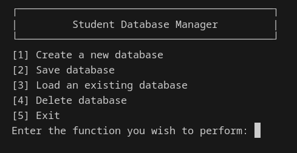

# C Student Database Manager

A simple, lightweight student database manager that runs entirely in the command line. This project is written in pure C and focuses on efficient data management and fundamental programming principles.




## Features

* **Full CRUD Functionality:** Add, update, and delete student records (ID, Name, Score).
* **Data Persistence:** Functions to create, load, save, and delete databases.
* **Powerful Sorting:** Sort the student list with id, implemented with an efficient Merge Sort algorithm.
* **Clean CLI:** A user-friendly, menu-driven interface for easy navigation and management.
* **Modular Code:** The project is structured with header (`.h`) and source (`.c`) files for better organization and readability.

## Technology Stack

* **Language:** C (C99 standard)
* **Compiler:** GCC
* **Version Control:** Git & GitHub

## Getting Started

### Prerequisites

You will need a C compiler like GCC installed on your system.

### How to Compile and Run

1.  **Clone the repository:**
    ```bash
    git clone https://github.com/kultaran-Singh/student-database-c.git
    cd student-database-c
    ```

2.  **Compile the source code:**
    ```bash
    gcc -o grade_manager main.c student.c dynarr.c database.c
    ```

3.  **Run the application:**
    ```bash
    ./grade_manager
    ```